# Zoho MCP Server – Functional Design Document (Draft v0.1)

> **Based on**: “Zoho MCP Server – Requirements Specification (Draft v0.1)” (📄 *Zoho MCP Server Requirements*)
> **Author**: ChatGPT
> **Date**: 2025‑06‑17

---

## 1. Scope & Goals

The Functional Design refines Phase‑1 scope:

* **Zoho Projects + WorkDrive** integration
* Exposed via **Model Context Protocol (MCP)**
* Hosted on **Render (Starter plan, Oregon)**

---

## 2. System Architecture

```mermaid
flowchart TD
  subgraph Clients
    CUR[Cursor IDE]
    CL[Claude / OpenAI Agents]
  end
  CUR -- JSON‑RPC (MCP) --> API[FastAPI MCP Server]
  CL  -- JSON‑RPC (MCP) --> API
  API -- OAuth2 --> ZP[Zoho Projects REST]
  API -- OAuth2 --> ZD[Zoho WorkDrive REST]
  ZP -. Webhook .-> API
  API -->|nightly| CRON[Cron Job: daily_report]
  API -->|Redis KV| REDIS[(Render Key‑Value)]
  API --> LOGS[(Render Logs → BigQuery)]
```



### 2.1 Module Decomposition

| Module              | Tech                  | Purpose                                            |
| ------------------- | --------------------- | -------------------------------------------------- |
| **mcp\_core**       | `fastapi‑mcp`         | MCP handshake, JWT auth, rate‑limit                |
| **zoho\_client**    | `httpx`, `zoho‑oauth` | Wrap Zoho Projects/WorkDrive endpoints             |
| **tool\_handlers**  | Python classes        | Business logic for each MCP tool                   |
| **webhook\_router** | FastAPI sub‑router    | Verify HMAC → dispatch events                      |
| **cron\_jobs**      | Stand‑alone scripts   | Daily summary, overdue scan                        |
| **storage**         | Redis KV              | Cache access\_tokens, vector embeddings (optional) |

---

## 3. Tool Specification (MCP Manifest)

| Tool                  | Parameters (JSON Schema)                                        | Zoho Endpoint                  | Response                |
| --------------------- | --------------------------------------------------------------- | ------------------------------ | ----------------------- |
| **listTasks**         | `{project_id:str, status?:enum}`                                | `GET /tasks/`                  | `[task]` array          |
| **createTask**        | `{project_id:str, name:str, owner?:str, due_date?:date}`        | `POST /tasks/`                 | `task_id`               |
| **updateTask**        | `{task_id:str, status?:str, due_date?:date, owner?:str}`        | `PUT /tasks/{id}/`             | `ok`                    |
| **getProjectSummary** | `{project_id:str, period?:enum(week,month)}`                    | multiple                       | KPI JSON                |
| **downloadFile**      | `{file_id:str}`                                                 | `GET /workdrive/v1/files/{id}` | `file_url` (pre‑signed) |
| **uploadReviewSheet** | `{project_id:str, folder_id:str, name:str, content_base64:str}` | `POST /upload`                 | `file_id`               |
| **getTaskDetail**     | `{task_id:str}`                                                 | `GET /tasks/{id}/`             | `task` detail JSON      |
| **searchFiles**       | `{query:str, folder_id?:str}`                                   | `GET /workdrive/v1/search`     | `[file]` array          |

> **Validation**: Pydantic is used to validate params before API calls. Errors mapped to MCP `error` object (`code`, `message`).

---

## 4. Detailed Logic

### 4.1 `createTask` Handler

```python
async def createTask(project_id:str, name:str, owner:str|None=None, due_date:date|None=None):
    token = await oauth.get_token()
    payload = {"name": name, "owner": owner, "due_date": due_date}
    r = httpx.post(f"{API}/projects/{project_id}/tasks/",
                   headers={"Authorization": f"Zoho-oauthtoken {token}"},
                   json=payload, timeout=10)
    r.raise_for_status()
    return {"task_id": r.json()["task"]["id"]}
```

* **Retry** – 3 attempts, exponential back‑off 0.5 → 4 s.
* **Idempotency** – if 409 duplicate, return existing `task_id`.
* **Audit** – write event `{tool:"createTask", user:<jwt.sub>, task_id}` to Redis Stream.

### 4.2 `getProjectSummary`

1. Call `listTasks` (status=open,overdue,closed).
2. Compute:

   * `completion_rate = closed / total`
   * `overdue_count`
3. Return JSON used by LLM for natural‑language synthesis.

### 4.3 `getTaskDetail` Handler

```python
async def getTaskDetail(task_id:str):
    token = await oauth.get_token()
    r = httpx.get(f"{API}/tasks/{task_id}/",
                  headers={"Authorization": f"Zoho-oauthtoken {token}"},
                  timeout=10)
    r.raise_for_status()
    task_data = r.json()["task"]
    # Include description, comments, and history
    return {
        "id": task_data["id"],
        "name": task_data["name"],
        "description": task_data.get("description", ""),
        "comments": task_data.get("comments", []),
        "history": task_data.get("history", []),
        "status": task_data["status"],
        "owner": task_data.get("owner"),
        "due_date": task_data.get("due_date")
    }
```

### 4.4 `searchFiles` Handler

```python
async def searchFiles(query:str, folder_id:str|None=None):
    token = await oauth.get_token()
    params = {"query": query}
    if folder_id:
        params["folder_id"] = folder_id
    r = httpx.get(f"{API}/workdrive/v1/search",
                  headers={"Authorization": f"Zoho-oauthtoken {token}"},
                  params=params,
                  timeout=10)
    r.raise_for_status()
    return {"files": r.json()["data"]}
```

---

## 5. Sequence Diagrams

### 5.1 Cursor ⇒ createTask

```mermaid
sequenceDiagram
    participant Dev
    participant CUR as Cursor LLM
    participant API as MCP Server
    participant ZP as Zoho Projects
    Dev->>CUR: "新しいタスク作って…"
    CUR->>API: callTool:createTask
    API->>ZP: POST /tasks
    ZP-->>API: 201 + task_id
    API-->>CUR: result(task_id)
    CUR-->>Dev: "タスク #123 を登録しました"
```



### 5.2 Nightly Summary Cron


---

## 6. Data Models

```yaml
Task:
  id: str
  name: str
  owner: str
  status: enum(open, closed, overdue)
  created_at: datetime
  due_date: date
  url: str
ProjectSummary:
  project_id: str
  completion_rate: float
  overdue_count: int
  total_tasks: int
```

---

## 7. Configuration & Secrets

| Key                  | Purpose     | Source        |
| -------------------- | ----------- | ------------- |
| `ZOHO_CLIENT_ID`     | OAuth       | Render Secret |
| `ZOHO_CLIENT_SECRET` | OAuth       | Render Secret |
| `ZOHO_REFRESH_TOKEN` | Token       | Render Secret |
| `JWT_SECRET`         | Client auth | Render Secret |
| `PORTAL_ID`          | Zoho portal | env           |
| `REDIS_URL`          | Cache       | env           |

---

## 8. Security Design

* **Transport**: HTTPS (Render cert)
* **Client Auth**: JWT (HS256) – issued via internal login UI; expires 12 h.
* **IP Allow‑List**: Render Firewall to company VPN CIDR.
* **Zoho Scope**: `ZohoProjects.tasks.ALL`, `ZohoProjects.files.READ`, `ZohoWorkDrive.files.ALL` only.
* **Rate Limiter**: 100 req/min per client, `slowapi` middleware.

---

## 9. Logging & Monitoring

| Metric       | Threshold    | Action                      |
| ------------ | ------------ | --------------------------- |
| 5xx rate     | >2 %/5 min   | PagerDuty                   |
| Zoho 429     | any          | warn + exponential back‑off |
| Token expiry | <3 days left | auto‑refresh + Slack alert  |

---

## 10. Deployment (Render)

```yaml
services:
  - type: web
    name: mcp-zoho
    runtime: python
    region: oregon
    plan: starter
    buildCommand: pip install -r requirements.txt
    startCommand: uvicorn server.main:app --host 0.0.0.0 --port $PORT
    envVars:
      - fromGroup: zoho-mcp-prod
  - type: cron
    name: nightly-summary
    schedule: "0 9 * * *"  # 09:00 UTC (~02:00 PST)
    command: "python server/cron/daily_report.py"
    envVars:
      - fromGroup: zoho-mcp-prod
```

---

## 11. Test Plan

| Level           | Framework                      | Coverage                       |
| --------------- | ------------------------------ | ------------------------------ |
| **Unit**        | pytest                         | tool\_handlers 90 %            |
| **Integration** | pytest + `httpx.MockTransport` | Zoho API stubs                 |
| **E2E**         | `pytest-bdd`                   | Cursor script → Render staging |

### 11.1 Test Cases for New Functions

| Test ID | Function | Test Case | Expected Result |
| ------- | -------- | --------- | --------------- |
| T-009   | getTaskDetail | Valid task ID | Returns task with description, comments, history |
| T-010   | getTaskDetail | Invalid task ID | Returns 404 error |
| T-011   | searchFiles | Query with results | Returns matching files array |
| T-012   | searchFiles | Query with folder_id filter | Returns files within specific folder |

---

## 12. Migration & Roll‑out

1. **Staging service** (`mcp-zoho‑stg`) with separate OAuth creds.
2. Internal beta with 5 developers → gather feedback.
3. Review security → move to prod service, switch manifest URL.

---

## 13. Future Extensions

* **Books & CRM** tool sets (Phase 2)
* **Vector Embeddings** of project docs → semantic Q\&A
* **LangChain Agent Executor** plugin mode

---

### Appendix A – Error Codes

| Code      | Meaning              |
| --------- | -------------------- |
| `ZP_401`  | Invalid Zoho token   |
| `ZP_429`  | Rate limit hit       |
| `MCP_400` | Validation error     |
| `MCP_500` | Unexpected exception |
